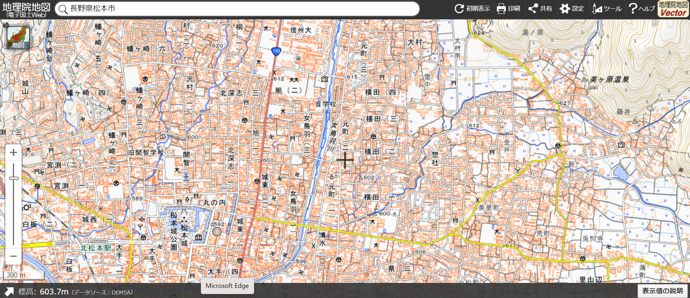

# My Second Hometown Matsumoto City, NAGANO 

[地理院地図（電子国土Web）|長野県松本市](https://maps.gsi.go.jp/#14/36.241077/137.975950/&base=std&ls=std&disp=1&vs=c1g1j0h0k0l0u0t0z0r0s0m0f1)
 

## Let's review the map!
### Why did you choose this map?
I choose Matsumoto city map because I've experienced to stay in there for a month on summer vacation of this year! I was working as staff in the guesthouse on Nawate street of city. I'm fall in love the city, so Matsumoto is like my second hometown,,.There are cool mountains and nature, kind people, wounderful traditional culture; music,art, and festivals and many hotsprings! 
I'm going to expalin about the attractive of Matsumoto with the map. 

### What does the map show?
As you can see, there is a castle! It's called Matsumoto castle （松本城）which is one of Japan's premire historic castles. 

In addition, Metoba river (女鳥羽川) flows through the city, so it is so chillax to see and listen its sounds the frowing river from the bridge. 

Matsumoto is the best hotsprings spot, so there are a lot of hotsprings in anywhere. One of hotsprings, Utukushigahara hot spring is a representitive thing. You can enjoy and relax your tired body after going to hiking trip such as Kamikouchi and Azumino. 

Matsumoto has many cultural buildings, especially, there is "Former Kaichi School." (旧開智学校) This is one of the first schools in Japan. It has very old story, and also Cathoric missioners visited and built the charch. 

### What do you like about it and what do you not like about it?
I like Matsumoto castle the best. It is shown that it is surrounding by lake. I love to see the reflection of the castle by moon light at the night. Then, a swan and a bunch of koi fish are living in the lake, so such nice place for me. 

On the other hand, Matsumoto city is pretty confortable and beautiful place, but transformation access is kind of more unconfortable than Kanto area because Matsumoto is the 2nd biggest of city in Nagano. Therefore, it is quite hard to get the trains when if you go travel to far away by train.